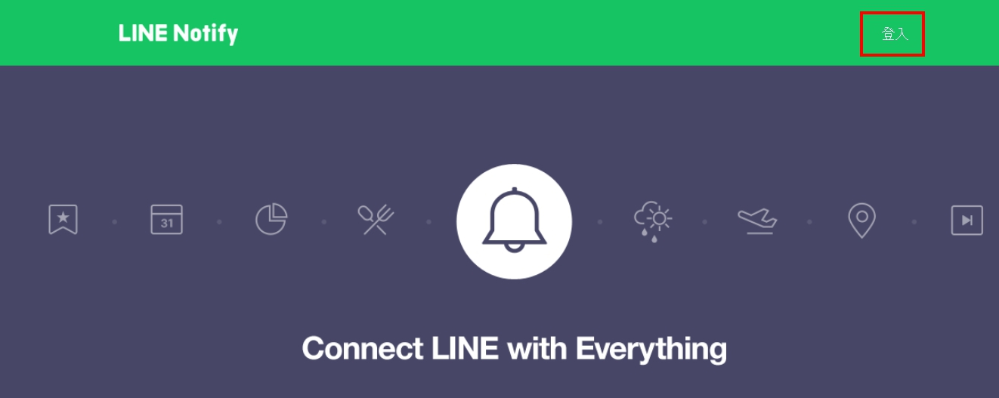
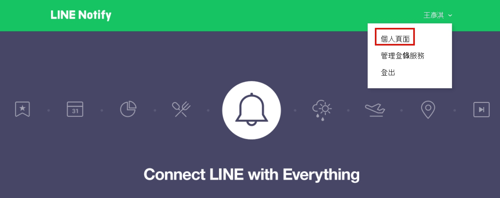
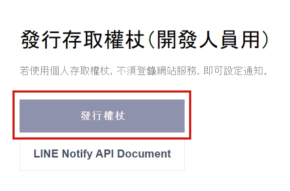
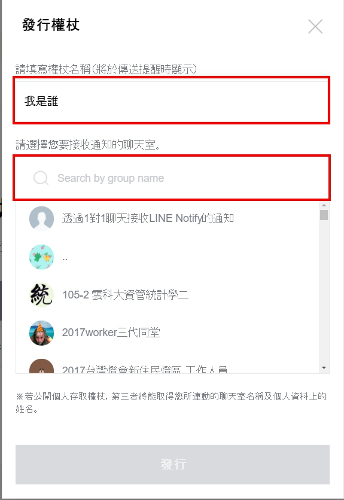

# LineReport

## OutLine
- [目的](#目的)
- [requirement](#requirement)
- [功能說明](#功能說明)
- [運行步驟](#運行步驟)
- [技術說明](#技術說明)

### 目的
- 想在第一時間就接收到漫畫更新的資訊，以及當期漫畫內容

### requirement

### 功能說明
- 監測漫畫網站(selenium)
    - 監測漫畫網站 https://comicbus.com/ 上所指定的漫畫是否更新
- 下載圖片
    - 下載當前最新級數跟DB內級數的差距裡的圖片
- 通知
    - 利用Line Notify進行群組通知並顯示圖片

### 運行步驟

### 技術說明
- [Line Notify 綁定步驟](#linenotify綁定步驟)
- [Line send message by python](#Linesendmessagebypython)
- [Selenium](#Selenium)

#### Line Notify 綁定步驟
1. 到此網址進行登入 https://notify-bot.line.me/zh_TW/


2. 登入後點選右上角的圖示，再點擊「個人頁面」


3. 進入後往下拉，會看到按下「發行權杖」


4. 接下來必須設定權杖通知、通知哪個群組，按下發行後，會有一組token產生，必須記起來這組token碼


#### Line send message by python

```python
import requests
token = "BBBxxxxxxxxxxxxxxxxxxxxx"
headers = {
    "Authorization": "Bearer " + token
}

payload = {
    "message": "最新一期漫畫"
}
res = requests.post("https://notify-api.line.me/api/notify", headers=headers, data=payload)
```

#### Selenium

```python
from selenium import webdriver
from bs4 import BeautifulSoup

page_url = "https://comicbus.live/online/a-103.html?ch={}-{}"
driver = webdriver.Edge()
driver.get(page_url.format(1, 1))
soup = BeautifulSoup(driver.page_source, "html.parser")
imgUrl = "https:" + soup.select_one("#TheImg").get("src")
```
